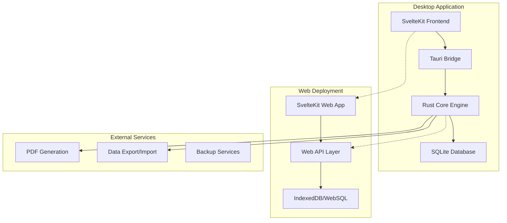
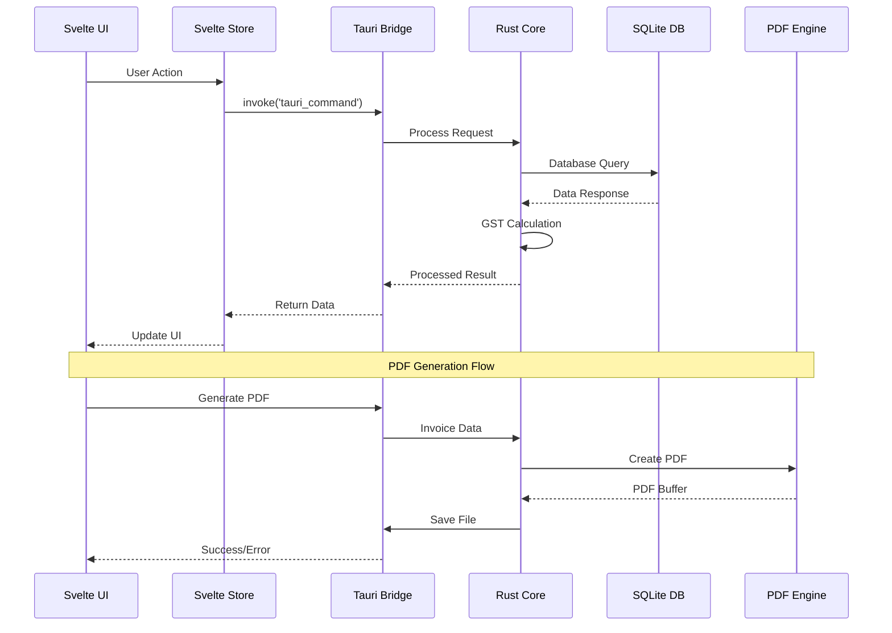
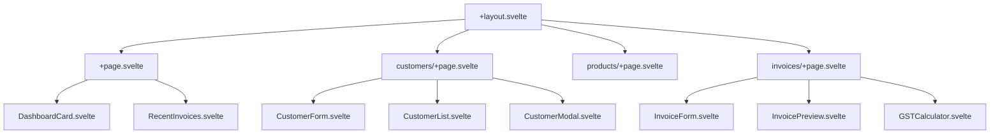

# System Architecture - Payvlo GST Invoice Generator

**Last Updated**: 2025-06-28  
**Project Phase**: Technical Architecture Documentation  
**Status**: Auto-generated from [plan.md](../plan.md)

## 📋 Table of Contents

1. [Architecture Overview](#architecture-overview)
2. [Technology Stack](#technology-stack)
3. [System Design](#system-design)
4. [Data Architecture](#data-architecture)
5. [Frontend Architecture](#frontend-architecture)
6. [Backend Architecture](#backend-architecture)
7. [Cross-Platform Design](#cross-platform-design)
8. [Security Architecture](#security-architecture)
9. [Performance Architecture](#performance-architecture)
10. [Integration Patterns](#integration-patterns)

## 🏗️ Architecture Overview

### **Architectural Style: Desktop-First Hybrid Application**

Payvlo follows a **desktop-first hybrid architecture** that combines the performance of native applications with the flexibility of web technologies, optimized for GST compliance and cross-platform deployment.



### **Core Architectural Principles**

1. **Offline-First**: Primary focus on local data storage and operations
2. **Performance-Optimized**: Target <5MB app size, <100MB memory, <1s startup
3. **GST-Compliant**: Built-in compliance with Indian tax regulations
4. **Cross-Platform**: Native performance on Windows, macOS, Linux
5. **Lightweight**: Minimal dependencies, optimized resource usage
6. **Secure**: Sandboxed operations, data validation, secure PDF generation

## 🛠️ Technology Stack

### **Frontend Layer**

```typescript
{
  "framework": "SvelteKit",
  "language": "TypeScript",
  "styling": "TailwindCSS + Skeleton UI",
  "stateManagement": "Svelte Stores",
  "validation": "svelte-forms-lib + Zod",
  "testing": "Vitest + Svelte Testing Library"
}
```

### **Backend Layer**

```rust
{
  "runtime": "Tauri (Rust)",
  "database": "SQLite + rusqlite",
  "serialization": "serde",
  "async": "tokio",
  "testing": "cargo test + mockall",
  "security": "tauri::api security features"
}
```

### **Build & Deployment**

```json
{
	"bundler": "Tauri Bundler",
	"packageManager": "pnpm",
	"taskRunner": "Vite",
	"platforms": ["Windows MSI", "macOS DMG", "Linux AppImage"],
	"webDeploy": "Static Site Generation (SSG)"
}
```

### **Development Tools**

```json
{
	"linting": "ESLint + Clippy",
	"formatting": "Prettier + rustfmt",
	"testing": "Vitest + Playwright + Cargo test",
	"documentation": "AURA-integrated docs",
	"versionControl": "Git + Conventional Commits"
}
```

## 🎯 System Design

### **Layered Architecture Pattern**

```
┌─────────────────────────────────────────┐
│           Presentation Layer            │
│  ┌─────────────┐ ┌─────────────────────┐ │
│  │   Svelte    │ │    Skeleton UI      │ │
│  │ Components  │ │   Design System     │ │
│  └─────────────┘ └─────────────────────┘ │
└─────────────────────────────────────────┘
┌─────────────────────────────────────────┐
│            Business Layer               │
│  ┌─────────────┐ ┌─────────────────────┐ │
│  │     GST     │ │    Invoice Logic    │ │
│  │ Calculation │ │   & Validation      │ │
│  │   Engine    │ │                     │ │
│  └─────────────┘ └─────────────────────┘ │
└─────────────────────────────────────────┘
┌─────────────────────────────────────────┐
│            Service Layer                │
│  ┌─────────────┐ ┌─────────────────────┐ │
│  │   Tauri     │ │    PDF Generator    │ │
│  │   Commands  │ │   File Operations   │ │
│  └─────────────┘ └─────────────────────┘ │
└─────────────────────────────────────────┘
┌─────────────────────────────────────────┐
│           Data Access Layer             │
│  ┌─────────────┐ ┌─────────────────────┐ │
│  │   SQLite    │ │   Repository        │ │
│  │  Database   │ │    Pattern          │ │
│  └─────────────┘ └─────────────────────┘ │
└─────────────────────────────────────────┘
```

### **Component Interaction Flow**



## 💾 Data Architecture

### **Database Schema Design**

**Entity Relationship Diagram:**

```mermaid
erDiagram
    COMPANY {
        id INTEGER PK
        name TEXT
        gstin TEXT
        address TEXT
        email TEXT
        phone TEXT
        logo_path TEXT
        created_at DATETIME
        updated_at DATETIME
    }

    CUSTOMERS {
        id INTEGER PK
        name TEXT
        gstin TEXT
        address TEXT
        city TEXT
        state TEXT
        pincode TEXT
        email TEXT
        phone TEXT
        created_at DATETIME
        updated_at DATETIME
    }

    PRODUCTS {
        id INTEGER PK
        name TEXT
        description TEXT
        hsn_code TEXT
        unit TEXT
        default_price REAL
        gst_rate INTEGER
        category TEXT
        created_at DATETIME
        updated_at DATETIME
    }

    INVOICES {
        id INTEGER PK
        invoice_number TEXT UNIQUE
        customer_id INTEGER FK
        invoice_date DATE
        due_date DATE
        place_of_supply TEXT
        reverse_charge BOOLEAN
        status TEXT
        subtotal REAL
        total_tax REAL
        total_amount REAL
        notes TEXT
        created_at DATETIME
        updated_at DATETIME
    }

    INVOICE_ITEMS {
        id INTEGER PK
        invoice_id INTEGER FK
        product_id INTEGER FK
        description TEXT
        hsn_code TEXT
        quantity REAL
        unit TEXT
        rate REAL
        discount_percent REAL
        taxable_value REAL
        gst_rate INTEGER
        cgst_amount REAL
        sgst_amount REAL
        igst_amount REAL
        total_amount REAL
    }

    COMPANY ||--o{ INVOICES : creates
    CUSTOMERS ||--o{ INVOICES : receives
    INVOICES ||--o{ INVOICE_ITEMS : contains
    PRODUCTS ||--o{ INVOICE_ITEMS : references
```

### **Data Access Patterns**

**Repository Pattern Implementation:**

```rust
// src-tauri/src/database/repository.rs
use async_trait::async_trait;
use serde::{Deserialize, Serialize};

#[async_trait]
pub trait Repository<T> {
    async fn create(&self, entity: T) -> Result<T, DatabaseError>;
    async fn find_by_id(&self, id: i64) -> Result<Option<T>, DatabaseError>;
    async fn find_all(&self) -> Result<Vec<T>, DatabaseError>;
    async fn update(&self, entity: T) -> Result<T, DatabaseError>;
    async fn delete(&self, id: i64) -> Result<bool, DatabaseError>;
}

pub struct CustomerRepository {
    db: Arc<Database>,
}

#[async_trait]
impl Repository<Customer> for CustomerRepository {
    async fn create(&self, customer: Customer) -> Result<Customer, DatabaseError> {
        let query = r#"
            INSERT INTO customers (name, gstin, address, city, state, pincode, email, phone)
            VALUES (?1, ?2, ?3, ?4, ?5, ?6, ?7, ?8)
            RETURNING *
        "#;

        let result = sqlx::query_as::<_, Customer>(query)
            .bind(&customer.name)
            .bind(&customer.gstin)
            .bind(&customer.address)
            .bind(&customer.city)
            .bind(&customer.state)
            .bind(&customer.pincode)
            .bind(&customer.email)
            .bind(&customer.phone)
            .fetch_one(&self.db.pool)
            .await?;

        Ok(result)
    }

    // Additional implementation...
}
```

### **Data Validation Layer**

**Rust-Side Validation:**

```rust
// src-tauri/src/models/customer.rs
use serde::{Deserialize, Serialize};
use validator::{Validate, ValidationError};

#[derive(Debug, Serialize, Deserialize, Validate)]
pub struct Customer {
    pub id: Option<i64>,

    #[validate(length(min = 1, max = 100, message = "Name must be 1-100 characters"))]
    pub name: String,

    #[validate(custom = "validate_gstin")]
    pub gstin: String,

    #[validate(length(min = 1, max = 500, message = "Address must be 1-500 characters"))]
    pub address: String,

    #[validate(length(min = 1, max = 100))]
    pub city: String,

    #[validate(length(min = 1, max = 50))]
    pub state: String,

    #[validate(length(min = 6, max = 6, message = "Pincode must be 6 digits"))]
    pub pincode: String,

    #[validate(email)]
    pub email: Option<String>,

    #[validate(length(min = 10, max = 15))]
    pub phone: Option<String>,
}

fn validate_gstin(gstin: &str) -> Result<(), ValidationError> {
    if gstin.len() != 15 {
        return Err(ValidationError::new("Invalid GSTIN length"));
    }

    // Additional GSTIN validation logic
    Ok(())
}
```

## 🎨 Frontend Architecture

### **SvelteKit Application Structure**

```
src/
├── app.html                 # Main HTML template
├── app.d.ts                # Global type definitions
├── lib/                    # Shared library code
│   ├── components/         # Reusable UI components
│   │   ├── forms/         # Form components
│   │   ├── tables/        # Data display components
│   │   ├── modals/        # Modal dialogs
│   │   └── ui/            # Basic UI elements
│   ├── stores/            # Svelte stores (state management)
│   │   ├── customers.ts   # Customer data store
│   │   ├── products.ts    # Product data store
│   │   ├── invoices.ts    # Invoice data store
│   │   └── app.ts         # App-wide state
│   ├── services/          # Business logic services
│   │   ├── api.ts         # Tauri API wrapper
│   │   ├── gst.ts         # GST calculation service
│   │   ├── validation.ts  # Form validation
│   │   └── pdf.ts         # PDF generation service
│   ├── types/             # TypeScript type definitions
│   └── utils/             # Utility functions
└── routes/                # SvelteKit routes
    ├── +layout.svelte     # Root layout
    ├── +page.svelte       # Dashboard page
    ├── customers/         # Customer management
    ├── products/          # Product management
    ├── invoices/          # Invoice management
    └── settings/          # Application settings
```

### **State Management Pattern**

**Svelte Stores Architecture:**

```typescript
// src/lib/stores/customers.ts
import { writable, derived } from 'svelte/store';
import type { Customer } from '$lib/types';
import { invoke } from '@tauri-apps/api/tauri';

interface CustomerStore {
	customers: Customer[];
	selectedCustomer: Customer | null;
	loading: boolean;
	error: string | null;
}

const initialState: CustomerStore = {
	customers: [],
	selectedCustomer: null,
	loading: false,
	error: null
};

function createCustomerStore() {
	const { subscribe, set, update } = writable<CustomerStore>(initialState);

	return {
		subscribe,

		async loadCustomers() {
			update((state) => ({ ...state, loading: true, error: null }));

			try {
				const customers = await invoke<Customer[]>('get_all_customers');
				update((state) => ({
					...state,
					customers,
					loading: false
				}));
			} catch (error) {
				update((state) => ({
					...state,
					loading: false,
					error: error.toString()
				}));
			}
		},

		async createCustomer(customerData: Omit<Customer, 'id'>) {
			update((state) => ({ ...state, loading: true }));

			try {
				const newCustomer = await invoke<Customer>('create_customer', {
					customerData
				});

				update((state) => ({
					...state,
					customers: [...state.customers, newCustomer],
					loading: false
				}));

				return newCustomer;
			} catch (error) {
				update((state) => ({
					...state,
					loading: false,
					error: error.toString()
				}));
				throw error;
			}
		},

		selectCustomer(customer: Customer | null) {
			update((state) => ({ ...state, selectedCustomer: customer }));
		},

		reset() {
			set(initialState);
		}
	};
}

export const customerStore = createCustomerStore();

// Derived stores for computed values
export const customerList = derived(customerStore, ($store) => $store.customers);

export const isLoadingCustomers = derived(customerStore, ($store) => $store.loading);
```

### **Component Architecture**

**Component Hierarchy:**



**Reusable Component Pattern:**

```svelte
<!-- src/lib/components/forms/CustomerForm.svelte -->
<script lang="ts">
	import { createEventDispatcher } from 'svelte';
	import { fade } from 'svelte/transition';
	import { InputChip, modalStore } from '@skeletonlabs/skeleton';
	import type { Customer } from '$lib/types';
	import { validateGSTIN } from '$lib/utils/validation';

	export let customer: Partial<Customer> = {};
	export let loading = false;

	const dispatch = createEventDispatcher<{
		save: Customer;
		cancel: void;
	}>();

	let errors: Record<string, string> = {};

	function validateForm(): boolean {
		errors = {};

		if (!customer.name?.trim()) {
			errors.name = 'Customer name is required';
		}

		if (!customer.gstin?.trim()) {
			errors.gstin = 'GSTIN is required';
		} else if (!validateGSTIN(customer.gstin)) {
			errors.gstin = 'Invalid GSTIN format';
		}

		if (!customer.address?.trim()) {
			errors.address = 'Address is required';
		}

		return Object.keys(errors).length === 0;
	}

	function handleSubmit() {
		if (validateForm()) {
			dispatch('save', customer as Customer);
		}
	}
</script>

<form on:submit|preventDefault={handleSubmit} class="space-y-4">
	<div class="grid grid-cols-1 md:grid-cols-2 gap-4">
		<div>
			<label class="label">
				<span>Customer Name *</span>
				<input
					type="text"
					bind:value={customer.name}
					class="input"
					class:input-error={errors.name}
					placeholder="Enter customer name"
					disabled={loading}
				/>
			</label>
			{#if errors.name}
				<p class="text-error-500 text-sm mt-1" transition:fade>
					{errors.name}
				</p>
			{/if}
		</div>

		<div>
			<label class="label">
				<span>GSTIN *</span>
				<input
					type="text"
					bind:value={customer.gstin}
					class="input"
					class:input-error={errors.gstin}
					placeholder="15-digit GSTIN"
					maxlength="15"
					disabled={loading}
				/>
			</label>
			{#if errors.gstin}
				<p class="text-error-500 text-sm mt-1" transition:fade>
					{errors.gstin}
				</p>
			{/if}
		</div>
	</div>

	<div class="flex justify-end space-x-2">
		<button
			type="button"
			class="btn variant-soft"
			on:click={() => dispatch('cancel')}
			disabled={loading}
		>
			Cancel
		</button>
		<button type="submit" class="btn variant-filled-primary" disabled={loading}>
			{#if loading}
				<span class="animate-spin mr-2">⟳</span>
			{/if}
			Save Customer
		</button>
	</div>
</form>
```

## ⚙️ Backend Architecture

### **Rust Core Engine Structure**

```
src-tauri/src/
├── main.rs                 # Application entry point
├── lib.rs                  # Library root
├── commands/               # Tauri command handlers
│   ├── mod.rs
│   ├── customers.rs        # Customer operations
│   ├── products.rs         # Product operations
│   ├── invoices.rs         # Invoice operations
│   └── reports.rs          # Reporting operations
├── models/                 # Data models
│   ├── mod.rs
│   ├── customer.rs
│   ├── product.rs
│   ├── invoice.rs
│   └── common.rs
├── database/               # Database layer
│   ├── mod.rs
│   ├── connection.rs       # Database connection
│   ├── migrations.rs       # Schema migrations
│   └── repository/         # Repository pattern
│       ├── mod.rs
│       ├── customer.rs
│       ├── product.rs
│       └── invoice.rs
├── services/               # Business logic
│   ├── mod.rs
│   ├── gst_calculator.rs   # GST calculation engine
│   ├── invoice_service.rs  # Invoice business logic
│   ├── pdf_generator.rs    # PDF generation
│   └── validation.rs       # Data validation
├── utils/                  # Utility functions
│   ├── mod.rs
│   ├── date.rs
│   ├── number.rs
│   └── file.rs
└── error.rs               # Error handling
```

### **Tauri Command Pattern**

**Command Structure:**

```rust
// src-tauri/src/commands/customers.rs
use tauri::State;
use crate::database::Database;
use crate::models::Customer;
use crate::error::AppError;

#[tauri::command]
pub async fn get_all_customers(
    db: State<'_, Database>
) -> Result<Vec<Customer>, AppError> {
    let customers = db.customer_repository()
        .find_all()
        .await?;

    Ok(customers)
}

#[tauri::command]
pub async fn create_customer(
    customer_data: Customer,
    db: State<'_, Database>
) -> Result<Customer, AppError> {
    // Validate customer data
    customer_data.validate()
        .map_err(AppError::ValidationError)?;

    // Check for duplicate GSTIN
    if let Some(_) = db.customer_repository()
        .find_by_gstin(&customer_data.gstin)
        .await? {
        return Err(AppError::DuplicateGSTIN);
    }

    // Create customer
    let customer = db.customer_repository()
        .create(customer_data)
        .await?;

    Ok(customer)
}

#[tauri::command]
pub async fn update_customer(
    customer: Customer,
    db: State<'_, Database>
) -> Result<Customer, AppError> {
    customer.validate()
        .map_err(AppError::ValidationError)?;

    let updated_customer = db.customer_repository()
        .update(customer)
        .await?;

    Ok(updated_customer)
}

#[tauri::command]
pub async fn delete_customer(
    customer_id: i64,
    db: State<'_, Database>
) -> Result<bool, AppError> {
    // Check if customer has any invoices
    let invoice_count = db.invoice_repository()
        .count_by_customer_id(customer_id)
        .await?;

    if invoice_count > 0 {
        return Err(AppError::CustomerHasInvoices);
    }

    let deleted = db.customer_repository()
        .delete(customer_id)
        .await?;

    Ok(deleted)
}
```

### **GST Calculation Engine**

**Core GST Logic:**

```rust
// src-tauri/src/services/gst_calculator.rs
use serde::{Deserialize, Serialize};
use rust_decimal::{Decimal, prelude::*};

#[derive(Debug, Serialize, Deserialize)]
pub enum TransactionType {
    IntraState,
    InterState,
}

#[derive(Debug, Serialize, Deserialize)]
pub struct GSTCalculation {
    pub taxable_amount: Decimal,
    pub gst_rate: i32,
    pub cgst_rate: Decimal,
    pub sgst_rate: Decimal,
    pub igst_rate: Decimal,
    pub cgst_amount: Decimal,
    pub sgst_amount: Decimal,
    pub igst_amount: Decimal,
    pub total_tax: Decimal,
    pub total_amount: Decimal,
}

#[derive(Debug)]
pub struct GSTCalculator;

impl GSTCalculator {
    pub fn calculate(
        taxable_amount: Decimal,
        gst_rate: i32,
        transaction_type: TransactionType,
    ) -> Result<GSTCalculation, String> {
        // Validate GST rate
        if ![0, 5, 12, 18, 28].contains(&gst_rate) {
            return Err(format!("Invalid GST rate: {}%", gst_rate));
        }

        let gst_rate_decimal = Decimal::from(gst_rate);
        let hundred = Decimal::from(100);

        let (cgst_rate, sgst_rate, igst_rate) = match transaction_type {
            TransactionType::IntraState => {
                let half_rate = gst_rate_decimal / Decimal::from(2);
                (half_rate, half_rate, Decimal::ZERO)
            },
            TransactionType::InterState => {
                (Decimal::ZERO, Decimal::ZERO, gst_rate_decimal)
            }
        };

        let cgst_amount = (taxable_amount * cgst_rate) / hundred;
        let sgst_amount = (taxable_amount * sgst_rate) / hundred;
        let igst_amount = (taxable_amount * igst_rate) / hundred;

        let total_tax = cgst_amount + sgst_amount + igst_amount;
        let total_amount = taxable_amount + total_tax;

        Ok(GSTCalculation {
            taxable_amount,
            gst_rate,
            cgst_rate,
            sgst_rate,
            igst_rate,
            cgst_amount,
            sgst_amount,
            igst_amount,
            total_tax,
            total_amount,
        })
    }

    pub fn calculate_reverse_charge(
        total_amount: Decimal,
        gst_rate: i32,
        transaction_type: TransactionType,
    ) -> Result<GSTCalculation, String> {
        let gst_rate_decimal = Decimal::from(gst_rate);
        let hundred = Decimal::from(100);
        let divisor = hundred + gst_rate_decimal;

        let taxable_amount = (total_amount * hundred) / divisor;

        Self::calculate(taxable_amount, gst_rate, transaction_type)
    }
}
```

## 📱 Cross-Platform Design

### **Platform-Specific Optimizations**

**Windows**: App data in `%APPDATA%`, MSI installer  
**macOS**: App support directory, DMG package  
**Linux**: XDG config directory, AppImage

### **Build Configuration**

**Tauri Configuration:**

```json
{
	"bundle": {
		"targets": ["msi", "dmg", "appimage"],
		"identifier": "com.payvlo.gst-invoice-generator"
	},
	"allowlist": {
		"fs": { "scope": ["$APPDATA/*", "$DOCUMENT/*", "$DOWNLOAD/*"] },
		"dialog": { "save": true, "open": true }
	}
}
```

## 🔒 Security Architecture

### **Security Principles**

1. **Sandboxed Operations**: File operations within allowed scopes
2. **Input Validation**: Comprehensive data validation
3. **SQL Injection Prevention**: Parameterized queries
4. **XSS Prevention**: Input sanitization and output encoding
5. **Data Encryption**: Sensitive data protection

### **Security Implementation**

**GSTIN Validation:**

```rust
static GSTIN_REGEX: Lazy<Regex> = Lazy::new(|| {
    Regex::new(r"^[0-9]{2}[A-Z]{5}[0-9]{4}[A-Z]{1}[1-9A-Z]{1}[Z]{1}[0-9A-Z]{1}$").unwrap()
});

pub fn validate_gstin(gstin: &str) -> bool {
    gstin.len() == 15 && GSTIN_REGEX.is_match(gstin) && validate_checksum(gstin)
}
```

## ⚡ Performance Architecture

### **Performance Optimization Strategies**

1. **Lazy Loading**: Components and data loaded on-demand
2. **Connection Pooling**: Efficient database connections
3. **Memory Management**: Careful resource allocation
4. **Caching**: Strategic data caching
5. **Code Splitting**: Modular architecture

### **Performance Targets**

- **App Size**: < 5MB
- **Memory Usage**: < 100MB idle
- **Startup Time**: < 1 second
- **PDF Generation**: < 2 seconds

## 🔌 Integration Patterns

### **Frontend-Backend Communication**

**API Service Layer:**

```typescript
class ApiService {
	async getCustomers(): Promise<Customer[]> {
		return await invoke<Customer[]>('get_all_customers');
	}

	async calculateGST(params): Promise<GSTCalculation> {
		return await invoke<GSTCalculation>('calculate_gst', params);
	}

	async generatePDF(invoice): Promise<string> {
		return await invoke<string>('generate_invoice_pdf', { invoice });
	}
}
```

### **Error Handling Pattern**

**Unified Error Handling:**

```typescript
export function handleError(error: any): void {
	const appError = normalizeError(error);
	showErrorModal(appError);
	logError(appError);
}
```

---

This architecture ensures Payvlo delivers a robust, scalable, and GST-compliant invoice generator with optimal performance across all platforms while maintaining strict security and data integrity standards.
